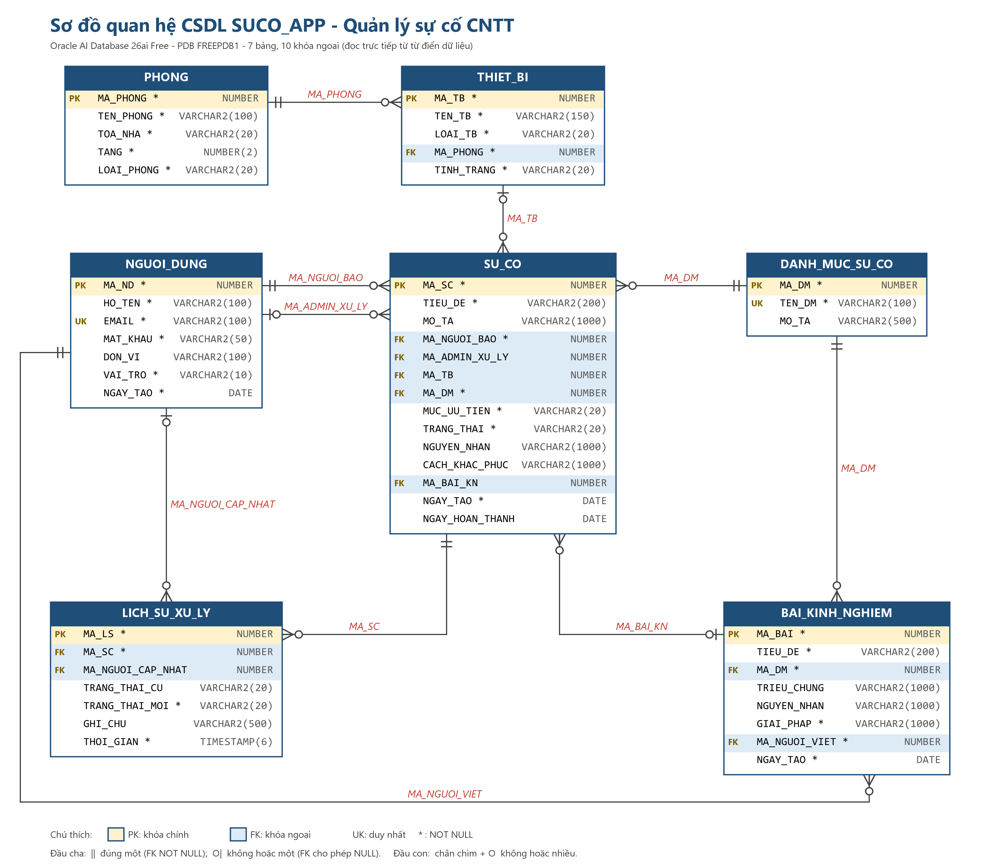
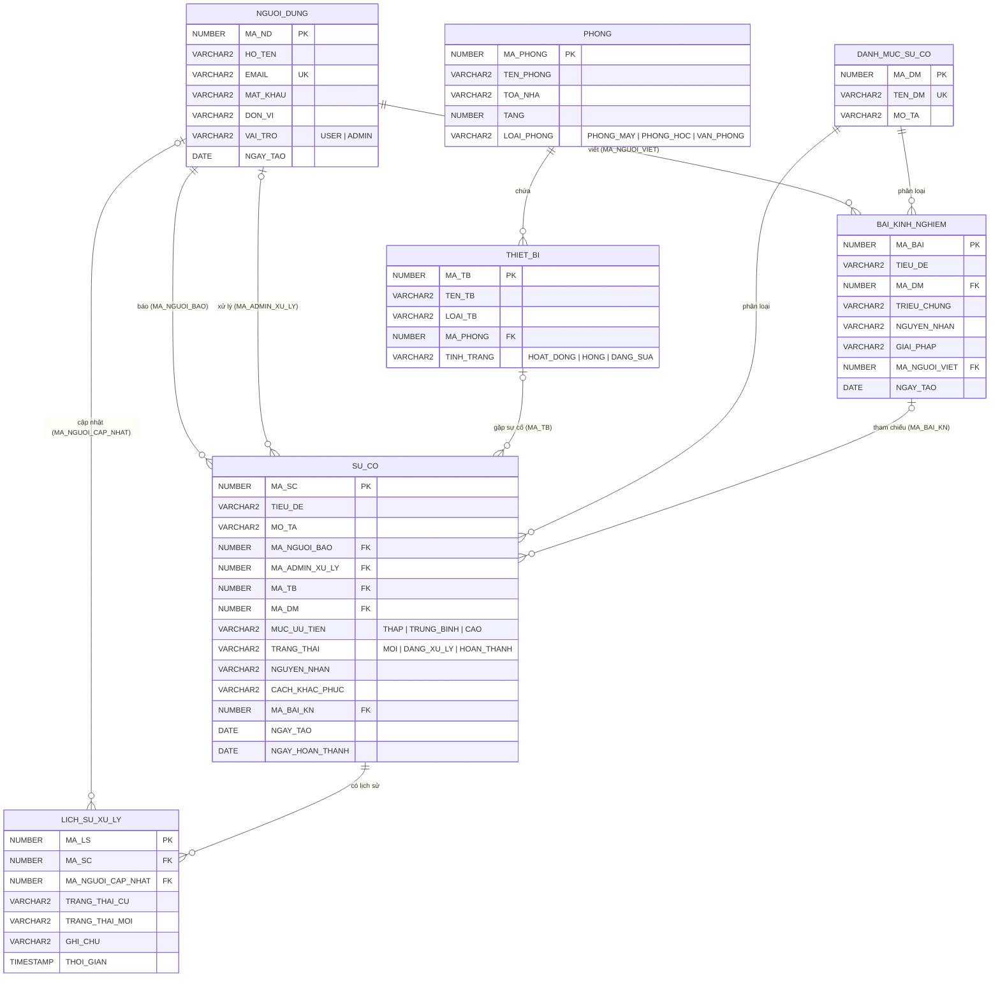

# Sơ đồ quan hệ CSDL - Hệ thống quản lý sự cố CNTT

Schema `SUCO_APP`, tablespace `TS_SUCO`.

## Sơ đồ ER (ảnh, đọc trực tiếp từ CSDL Oracle)



File ảnh: `docs/so_do_ER_SUCO_APP.png` (2928 x 2446 px, chèn vào Word nên để trang nằm ngang hoặc để ảnh chiếm cả chiều rộng trang). Ảnh được vẽ bằng `tools/VeSoDoER.java`: chương trình đọc bảng, cột, kiểu dữ liệu, khóa chính, khóa ngoại, ràng buộc duy nhất và NOT NULL từ từ điển dữ liệu Oracle (`user_tab_columns`, `user_constraints`, `user_cons_columns`), nên luôn khớp với CSDL thật. Vẽ lại sau khi sửa cấu trúc bảng:

```
java -cp <đường_dẫn>\ojdbc17-23.26.3.0.0.jar tools\VeSoDoER.java
```

(tham số tùy chọn: url, user, mật khẩu, tên file PNG; mặc định `SUCO_APP` trên `FREEPDB1`).

Ký hiệu: `PK` khóa chính (nền vàng), `FK` khóa ngoại (nền xanh), `UK` duy nhất, `*` NOT NULL. Đầu cha: `||` đúng một (FK NOT NULL), vòng tròn + thanh là không hoặc một (FK cho phép NULL). Đầu con: chân chim + vòng tròn là không hoặc nhiều.

## Sơ đồ Mermaid (bản văn bản)

Có thể dán khối Mermaid bên dưới vào bất kỳ công cụ nào hỗ trợ Mermaid (GitHub, VS Code, mermaid.live) để xuất hình khác.



## Mô tả các bảng

| Bảng | Vai trò | Khóa ngoại |
|---|---|---|
| NGUOI_DUNG | Sinh viên, giảng viên, cán bộ và admin (bộ phận IT) | - |
| PHONG | Phòng máy, phòng học, văn phòng theo tòa nhà và tầng | - |
| THIET_BI | Thiết bị đặt trong phòng | MA_PHONG -> PHONG |
| DANH_MUC_SU_CO | Danh mục dùng chung cho sự cố và bài kinh nghiệm | - |
| BAI_KINH_NGHIEM | Kho kinh nghiệm xử lý theo danh mục | MA_DM -> DANH_MUC_SU_CO; MA_NGUOI_VIET -> NGUOI_DUNG |
| SU_CO | Sự cố do người dùng báo, admin xử lý | MA_NGUOI_BAO, MA_ADMIN_XU_LY -> NGUOI_DUNG; MA_TB -> THIET_BI; MA_DM -> DANH_MUC_SU_CO; MA_BAI_KN -> BAI_KINH_NGHIEM |
| LICH_SU_XU_LY | Nhật ký đổi trạng thái, do trigger ghi | MA_SC -> SU_CO; MA_NGUOI_CAP_NHAT -> NGUOI_DUNG |

## Ràng buộc và đối tượng đi kèm

- **Cột cho phép NULL trong SU_CO:** `MA_ADMIN_XU_LY` (chưa có admin nhận), `MA_TB` (sự cố không gắn thiết bị, ví dụ quên mật khẩu), `MA_BAI_KN`, `NGUYEN_NHAN`, `CACH_KHAC_PHUC`, `NGAY_HOAN_THANH`.
- **CHECK:** `CK_SU_CO_NGAY_HT` bảo đảm `NGAY_HOAN_THANH >= NGAY_TAO`; các CHECK giới hạn giá trị vai trò, loại phòng, loại và tình trạng thiết bị, mức ưu tiên, trạng thái.
- **Trigger:** `TRG_SU_CO_LICH_SU` ghi `LICH_SU_XU_LY` khi `TRANG_THAI` đổi; `TRG_SU_CO_HOAN_THANH` tự gán `NGAY_HOAN_THANH`.
- **View:** `V_SU_CO_CHI_TIET` ghép SU_CO với người báo, admin, thiết bị, phòng, danh mục; web đọc từ view này.
